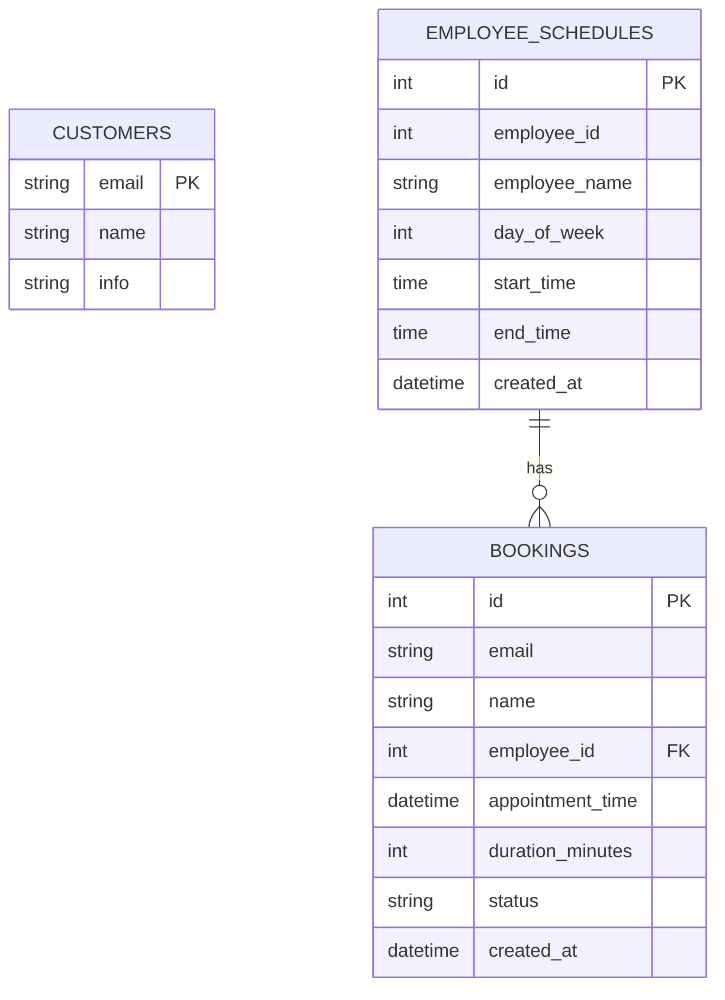
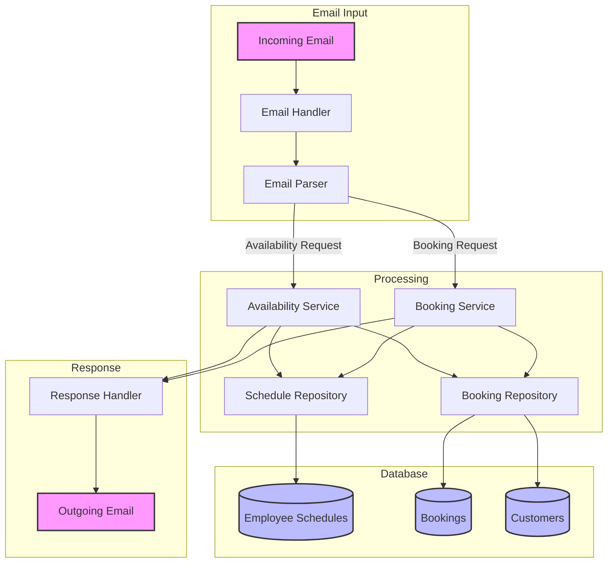

# System Data Flow and Schema

## Database Schema

## Data Flow Diagram

## Process Flow Description

1. **Email Input**
   - System receives incoming emails
   - Email Handler processes the raw email
   - Email Parser extracts intent and data

2. **Processing**
   - For Availability Requests:
     - Checks employee schedules
     - Checks existing bookings
     - Generates available time slots
   
   - For Booking Requests:
     - Validates requested time slot
     - Checks employee availability
     - Creates new booking
     - Updates customer information

3. **Database**
   - Employee Schedules: Stores working hours for each employee
   - Bookings: Records all appointments
   - Customers: Maintains customer information

4. **Response**
   - Generates appropriate email response
   - Includes booking confirmation or availability information
   - Sends response back to customer

## Key Components

- **Email Handler**: Manages email communication
- **Email Parser**: Extracts booking/availability requests
- **Availability Service**: Manages time slot availability
- **Booking Service**: Handles appointment creation
- **Response Handler**: Generates email responses
- **Repositories**: Interface with database tables 